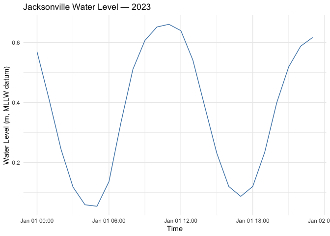
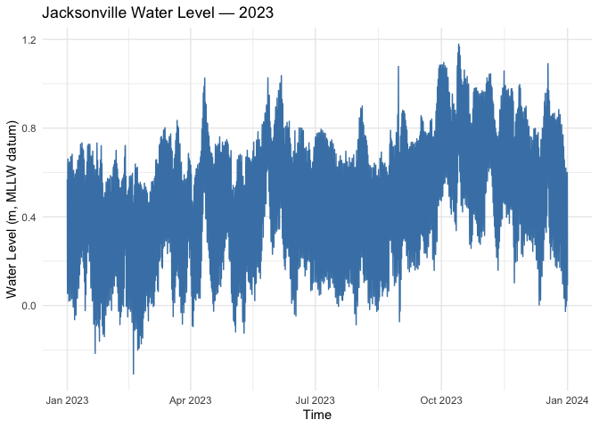
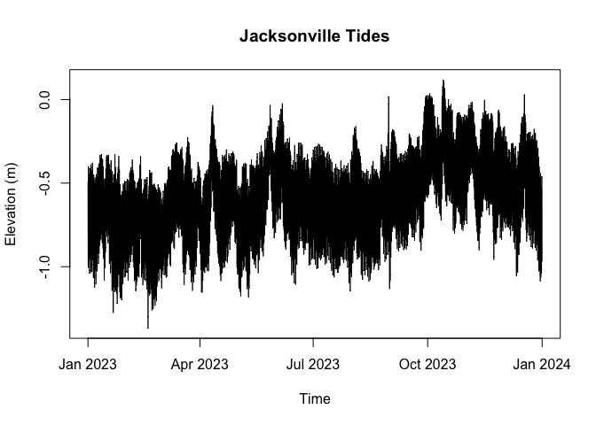

# Harmonic Analysis of Tides


``` r
library(magrittr)
library(lubridate)
```


    Attaching package: 'lubridate'

    The following objects are masked from 'package:base':

        date, intersect, setdiff, union

``` r
library(ggplot2)
```

## Data

### [British Oceanographic Data Centre](https://www.bodc.ac.uk/data/hosted_data_systems/sea_level/uk_tide_gauge_network/) - UK Tide Gauge Network

| Field           | Value              |
|-----------------|--------------------|
| Station name    | Portsmouth         |
| Location        | UK                 |
| Latitude        | 50° 48’ N          |
| Longitude       | 01° 06’ W          |
| Datum reference | ACD = ODN − 2.73 m |
| Time reference  | GMT                |
| Resolution      | 15-minutes         |
| Units           | Metric (m)         |

*Variables*

- ASLVBG02 (Observed surface elevation from bubbler gauge relative to
  ACD)
- Residual = Observed − Predicted (provided directly)

### [NOAA](https://tidesandcurrents.noaa.gov/) Tides & Currents

| Field | Value |
|----|----|
| Station name | Southbank Riverwalk, St Johns River (8720226) |
| Location | Jacksonville, FL, USA |
| Latitude | 30° 19.2’ N |
| Longitude | 81° 39.5’ W |
| Datum reference | [MLLW = MSL - 1.06 m]((https://tidesandcurrents.noaa.gov/datums.html?id=8720226)) |
| Time reference | EST |
| Resolution | 6-minutes |
| Units | “Standard” (f) or Metric (m) |

*Variables*

- Predicted tide
- Verified (observed) tide

A tidal datum is a fixed vertical reference used to measure water
levels. Different regions use different zero-points, so the same numeric
tide height can represent different true sea levels unless a common
baseline is used.

- The Portsmouth dataset uses Admiralty Chart Datum (ACD), which is
  approximately the Lowest Astronomical Tide and is 2.73 m below the UK
  national height reference ODN (≈ mean sea level).
- The NOAA station uses Mean Lower-Low Water (MLLW) as its zero, with
  Mean Sea Level (MSL) at this location being 1.06 m above MLLW.

To make the two records directly comparable, both time series should be
transformed to a common vertical datum, typically Mean Sea Level (MSL).

## Load data

The raw data files for Portsmouth and Jacksonville are stored in
`data/`.

``` r
library(httr)

base <- "https://api.tidesandcurrents.noaa.gov/api/prod/datagetter"
params <- list(
  begin_date = "20230101",
  end_date   = "20231231",
  station    = "8720226",
  product    = "hourly_height",   # use 'water_level' for 6-min; then do month by month
  datum      = "MLLW",
  time_zone  = "gmt",
  units      = "metric",
  format     = "csv",
  application= "RTides"
)

resp <- GET(base, query = params)
# JSON -> R list
data <- content(resp, "text", encoding = "UTF-8")
data <- read.csv(text = data, stringsAsFactors = FALSE)
# Print first and last 5 rows in one table
library(knitr)
n <- 5
nrows <- nrow(data)
if (nrows <= 2 * n) {
  show_data <- data
} else {
  show_data <- rbind(
    head(data, n),
    setNames(rep(list(rep("...")), ncol(data)), names(data)),
    tail(data, n)
  )
}
kable(show_data)
```

|      | Date.Time        | Water.Level | Sigma | I   | L   |
|:-----|:-----------------|:------------|:------|:----|:----|
| 1    | 2023-01-01 00:00 | 0.569       | 0.004 | 0   | 0   |
| 2    | 2023-01-01 01:00 | 0.411       | 0.005 | 0   | 0   |
| 3    | 2023-01-01 02:00 | 0.244       | 0.004 | 0   | 0   |
| 4    | 2023-01-01 03:00 | 0.118       | 0.003 | 0   | 0   |
| 5    | 2023-01-01 04:00 | 0.059       | 0.002 | 0   | 0   |
| 6    | …                | …           | …     | …   | …   |
| 8756 | 2023-12-31 19:00 | 0.589       | 0.004 | 0   | 0   |
| 8757 | 2023-12-31 20:00 | 0.505       | 0.005 | 0   | 0   |
| 8758 | 2023-12-31 21:00 | 0.355       | 0.005 | 0   | 0   |
| 8759 | 2023-12-31 22:00 | 0.197       | 0.007 | 0   | 0   |
| 8760 | 2023-12-31 23:00 | 0.091       | 0.004 | 0   | 0   |

``` r
fl_time <- as.POSIXct(data$Date.Time, tz = "UTC")
fl <- data.frame(time = fl_time, elevation = as.numeric(data$Water.Level))
# visualise first 24 hours of Jacksonville water level
ggplot(fl[fl$time >= "2023-01-01 00:00:00" & fl$time <= "2023-01-01 23:59:59", ], aes(x = time, y = elevation)) +
  geom_line(color = "steelblue") +
  labs(
    title = "Jacksonville Water Level — 2023",
    x = "Time",
    y = "Water Level (m, MLLW datum)"
  ) +
  theme_minimal()
```



``` r
ggplot(fl, aes(x = time, y = elevation)) +
  geom_line(color = "steelblue") +
  labs(
    title = "Jacksonville Water Level — 2023",
    x = "Time",
    y = "Water Level (m, MLLW datum)"
  ) +
  theme_minimal()
```



``` r
# Read CSV (expected columns: date, time, elevation)
portsmouth_raw <- read.csv("data/Portsmouth.csv", stringsAsFactors = FALSE)
portsmouth_raw <- portsmouth_raw[portsmouth_raw$date >= "2023-01-01" & portsmouth_raw$date <= "2023-12-31", ]

# Build POSIXct timestamps (minute resolution) 
portsmouth_time <- as.POSIXct(
  paste(portsmouth_raw$date, portsmouth_raw$time),
  tz = "UTC"
)
portsmouth_msl <- data.frame(time = portsmouth_time, elevation = as.numeric(portsmouth_raw$elevation))
```

    Warning in data.frame(time = portsmouth_time, elevation =
    as.numeric(portsmouth_raw$elevation)): NAs introduced by coercion

``` r
# visualise first 24 hours of Portsmouth water level
ggplot(portsmouth_msl[portsmouth_msl$time >= "2023-01-01 00:00:00" & portsmouth_msl$time <= "2023-01-01 23:59:59", ], aes(x = time, y = elevation)) +
  geom_line(color = "steelblue") +
  labs(
    title = "Portsmouth Water Level — 2023",
    x = "Time",
    y = "Water Level (m, MSL datum)"
  ) +
  theme_minimal()
```


``` r
ggplot(portsmouth_msl, aes(x = time, y = elevation)) +
  geom_line(color = "steelblue") +
  labs(
    title = "Portsmouth Water Level — 2023",
    x = "Time",
    y = "Water Level (m, MSL datum)"
  ) +
  theme_minimal()
```


