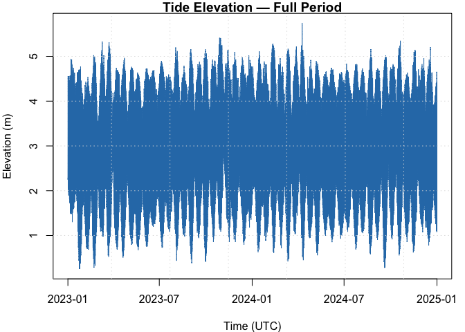
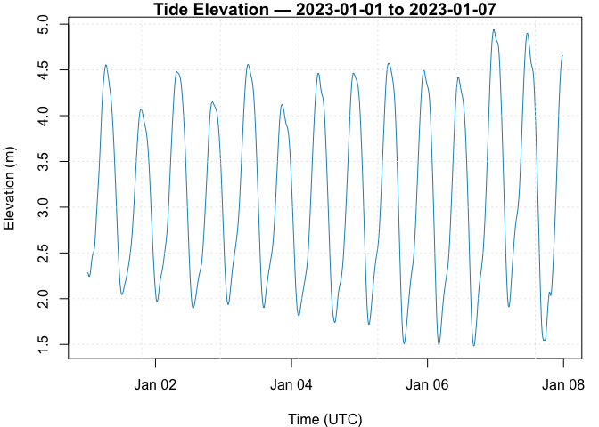
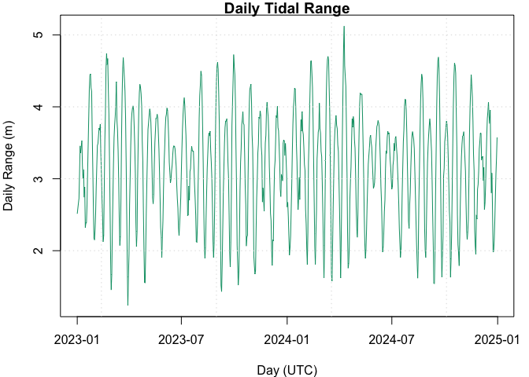

Portsmouth Tides — Basic Overview
================

### Introduction

This brief report reads `../data/Portsmouth.csv`, visualises the tide
elevation over time, and provides basic daily summaries (min, max, mean,
and daily range).

### Load data

### Basic overview

    ## $observations
    ## [1] 66792
    ## 
    ## $unique_days
    ## [1] 731
    ## 
    ## $time_start_utc
    ## [1] "2023-01-01 00:00 UTC"
    ## 
    ## $time_end_utc
    ## [1] "2024-12-31 23:45 UTC"
    ## 
    ## $elevation_summary
    ##    Min. 1st Qu.  Median    Mean 3rd Qu.    Max. 
    ##   0.251   2.127   2.902   2.986   3.958   5.743

### Tide elevation over time

<!-- -->

### First week (zoomed)

<!-- -->

### Daily summaries

    ##           day   min   max     mean range
    ## 1  2023-01-01 2.044 4.557 3.192167 2.513
    ## 2  2023-01-02 1.896 4.482 3.154229 2.586
    ## 3  2023-01-03 1.901 4.559 3.158635 2.658
    ## 4  2023-01-04 1.739 4.466 3.057625 2.727
    ## 5  2023-01-05 1.503 4.574 3.077469 3.071
    ## 6  2023-01-06 1.483 4.939 3.042562 3.456
    ## 7  2023-01-07 1.544 4.904 3.284292 3.360
    ## 8  2023-01-08 1.481 4.928 3.256813 3.447
    ## 9  2023-01-09 1.299 4.827 3.189687 3.528
    ## 10 2023-01-10 1.507 4.689 3.154583 3.182

#### Daily range over time

<!-- -->

### Key points

- **Lowest elevation**: 0.251 m  
- **Highest elevation**: 5.743 m  
- **Median daily range**: 3.253 m  
- **Mean daily range**: 3.179 m
