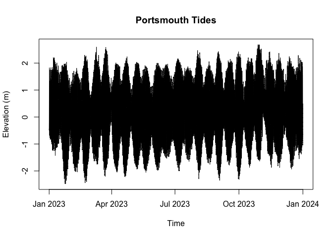

# Harmonic Analysis of Tides


``` r
library(magrittr)
library(lubridate)
```


    Attaching package: 'lubridate'

    The following objects are masked from 'package:base':

        date, intersect, setdiff, union

## Data
### [NOAA](https://tidesandcurrents.noaa.gov/) Tides & Currents

| Field | Value |
|----|----|
| Station name | Southbank Riverwalk, St Johns River (8720226) |
| Location | Jacksonville, FL, USA |
| Latitude | 30° 19.2’ N |
| Longitude | 81° 39.5’ W |
| Datum reference | [MLLW = MSL - 1.06 m]((https://tidesandcurrents.noaa.gov/datums.html?id=8720226)) |
| Time reference | EST |
| Resolution | 6-minutes |
| Units | “Standard” (f) or Metric (m) |
| Predicted tide | [Harmonic](https://tidesandcurrents.noaa.gov/education/tech-assist/training/user-guides/assets/pdfs/Tide_Predictions_User_Guide_v4.pdf) |
| Verified (observed) tide | preliminary: not quality controlled available up to todays date; **verified: quality controlled – month to year behind)** |


A tidal datum can be thought of as an imaginary fixed plane, or benchmark, relative to which we measure depths. Different regions and datasets use different datums.

The NOAA station uses Mean Lower-Low Water (MLLW) as its zero:
- Mean Lower Low Water (MLLW) = "The average of the lower low water height of each tidal day observed over the National Tidal Datum Epoch"
- Mean Sea Level (MSL) = "The arithmetic mean of hourly heights observed over the National Tidal Datum Epoch."
- MLLW = MSL - 1.06 m @ Southbank Riverwalk
- National Tidal Datum Epoch = "The specific 19-year period adopted by the National Ocean Service as the official time segment over which tide observations are taken and reduced to obtain mean values (e.g., mean lower low water, etc.) for tidal datums. It is necessary for standardization because of periodic and apparent secular trends in sea level. The present NTDE is 1983 through 2001 and is actively considered for revision every 20-25 years."

### [British Oceanographic Data Centre](https://www.bodc.ac.uk/data/hosted_data_systems/sea_level/uk_tide_gauge_network/) - UK Tide Gauge Network

| Field           | Value              |
|-----------------|--------------------|
| Station name    | Portsmouth         |
| Location        | UK                 |
| Latitude        | 50° 48’ N          |
| Longitude       | 01° 06’ W          |
| Datum reference | ACD = ODN − 2.73 m |
| Time reference  | GMT                |
| Resolution      | 15-minutes         |
| Units           | Metric (m)         |
| ASLVBG02        | Observed surface elevation from bubbler gauge relative to ACD |
| Residual        | The measured height minus the predicted height. The predicted values are derived from a database of tidal constants maintained by the National Oceanography Centre Application Group. All values are relative to Admiralty Chart Datum (ACD) |
| Surges          | Extreme surges are the maximum and minimum tidal residuals | 


- The UK national levelling network expresses heights in terms of ODN = average level of the sea at Newlyn (southwest England) 1915–21.
- Most published tide tables in Great Britain use the [Admiralty Chart Datum (ACD)](https://ntslf.org/tides/datum), which is the lowest level due to astronomical effects and excluding meteorological effects below the UK national height reference ODN.
- In Portsmouth, this is 2.73m below the ODN.


## Load data

The raw data files for Portsmouth and Jacksonville are stored in
`data/`.

``` r
# Read CSV (expected columns: date, time, elevation)
portsmouth_raw <- read.csv("data/Portsmouth.csv", stringsAsFactors = FALSE)
fl_raw <- read.csv("data/Florida.csv", stringsAsFactors = FALSE)

# Build POSIXct timestamps (minute resolution) and convert elevation to MSL
portsmouth_time <- as.POSIXct(
  paste(portsmouth_raw$date, portsmouth_raw$time),
  format = "%Y-%m-%d %H:%M",
  tz = "UTC"
)
portsmouth_elev_msl <- as.numeric(portsmouth_raw$elevation) - 2.73
```

    Warning: NAs introduced by coercion

``` r
portsmouth_msl <- data.frame(time = portsmouth_time, elevation = portsmouth_elev_msl)

fl_time <- as.POSIXct(
  paste(fl_raw$date, fl_raw$time),
  format = "%Y-%m-%d %H:%M",
  tz = "UTC"
)
fl_elev_msl <- as.numeric(fl_raw$elevation) - 1.06
fl_msl <- data.frame(time = fl_time, elevation = fl_elev_msl)

# plot 2023 data only
plot(portsmouth_msl$time[year(portsmouth_msl$time) == 2023], portsmouth_msl$elevation[year(portsmouth_msl$time) == 2023], type = "l", xlab = "Time", ylab = "Elevation (m)", main = "Portsmouth Tides")
```



``` r
plot(fl_msl$time, fl_msl$elevation, type = "l", xlab = "Time", ylab = "Elevation (m)", main = "Jacksonville Tides")
```


``` r
library(httr)

base <- "https://api.tidesandcurrents.noaa.gov/api/prod/datagetter"
params <- list(
  begin_date = "20230101",
  end_date   = "20231231",
  station    = "8720226",
  product    = "hourly_height",   # use 'water_level' for 6-min; then do month by month
  datum      = "MLLW",
  time_zone  = "gmt",
  units      = "metric",
  format     = "csv",
  application= "RTides"
)

resp <- GET(base, query = params)
# JSON -> R list
data <- content(resp, "text", encoding = "UTF-8")
data <- read.csv(text = data, stringsAsFactors = FALSE)
print(head(data))
```

             Date.Time Water.Level Sigma I L
    1 2023-01-01 00:00       0.569 0.004 0 0
    2 2023-01-01 01:00       0.411 0.005 0 0
    3 2023-01-01 02:00       0.244 0.004 0 0
    4 2023-01-01 03:00       0.118 0.003 0 0
    5 2023-01-01 04:00       0.059 0.002 0 0
    6 2023-01-01 05:00       0.054 0.003 0 0

``` r
library(ggplot2)
```
